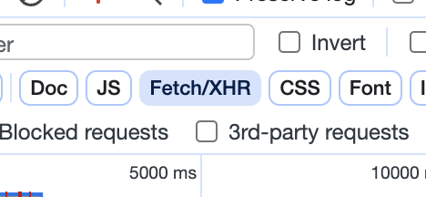
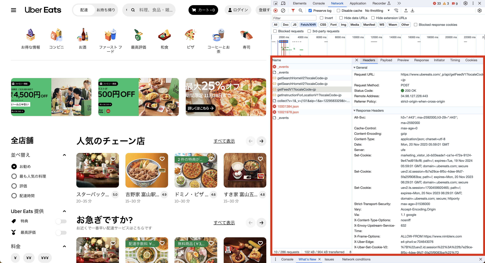
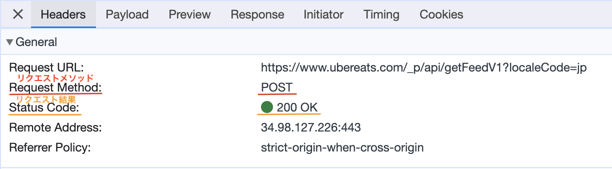
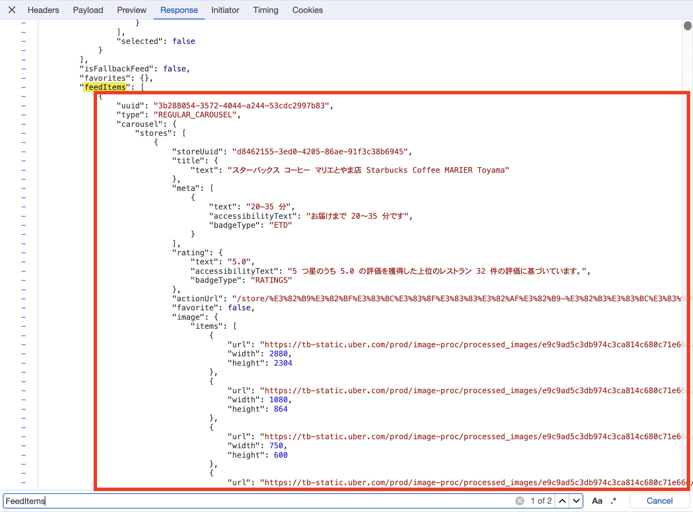

# HTTP リクエスト

## HTTP リクエストとは？

私たちが普段何気なく利用している Web サイトの裏側は、どのようになっているのか想像したことはありますか？  
裏側ではサーバーにデータを要求する**HTTP リクエスト**が行われています。(以後、「リクエスト」と呼ぶ。)

## Uber Eats を例に見てみよう!

[Uber Eats](https://www.ubereats.com/jp) を例にどんなリクエストが行われているのかみてみましょう。
(どこでもいいので住所を入れてください。)

1. 「F12」キーを押して開発者モードを開いてください。
2. 「Network」の項目に移動してください。
3. 「Fetch/XHR」をクリックして Fetch のみ表示されるようにしてください。
   
4. ページを再読み込みしてください。

赤枠で囲ったところにどんなリクエストを行ったか表示されます 👀  
普段見ている画面に美味しそうな食事が表示されるためには、裏でたくさんのリクエストを行っていることがわかります！

### 詳しく見てみる 👀

`getFeedV1?localeCode=jp`というリクエストを詳しく見てみましょう！  
クリックして「Headers」項目を開いてください。

`Request Method`というのはどのようなアクションのリクエストかを示しています。  
ここでは`POST`となっていますが、これ以外にも`GET`, `PUT`,`DELETE`など用途ごとに様々な種類のリクエストメソッドが存在します。

`Request Code`というのはリクエストに対する応答の種類を示しています。  
それぞれのステータスコードに意味があります。

- 200 番台は成功した場合
- 400 番台は不正なリクエストの場合
- 500 番台はサーバー側でエラーが発生した場合
  

次に、どのようなデータがサーバーから帰ってきたか見てみましょう！  
「Response」項目を開いてください。

開いたら`feedItems`という項目を探してみてください。  
その中にはお店の名前や場所、写真等が入っていることがわかりますね 👀

このようにして Web サイト・アプリは裏でサーバーからデータを取得を行っているわけです！

## 参考資料

[HTTP リクエストメソッド - MDN Web Docs](https://developer.mozilla.org/ja/docs/Web/HTTP/Methods)
